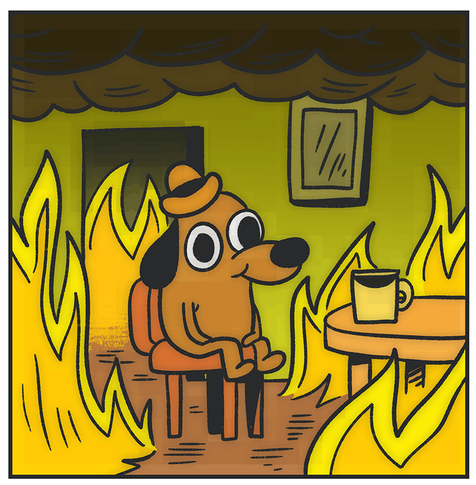
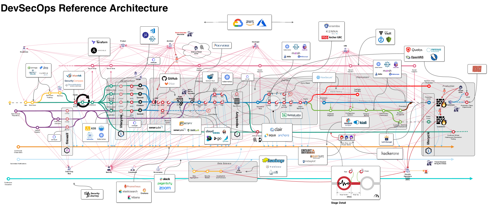

# История DevOps

Краткое описание: Будет рассмотренно прошлое философии DevOps и ее сравнение с методологией SRE.

Ключевые слова:

- DevOps
- SRE

## Как он появился и какие задачи призван был решить

### Точка зарождения

Выделить точку во времени, которую можно считать отправной в создании DevOps достаточно сложно. Так, Wikipedia говорит нам о том, что первая конференция, посвященная данной методологии, была проведена в 2009 году в городе Гент, Бельгия. Данная конференция была создана под руководством одного из основателей Патриком Дебуа.

В 2012 году в свет вышел первый State of DevOps за авторством Аланы Браун из компании Puppet. Данное исследование на протяжение 8 лет занимается опросом компаний со всего мира для проведения разнообразных измерений. Так, в качестве примера, можно привести:

- Time to market (время, которое проходит с коммита разработчика до появления новой версии приложения на “продуктовой” инфраструктуре);
- Время реагирования на инциденты и время их исправления;
- Скорость разработки и проверки разнообразных гипотез.

Данный опрос проводится с целью узнать степень проникновения DevOps методологии в бизнес в разных сферах экономики, а также оценить его влияние на производственный цикл. С 2014 года данный опрос выходит на ежегодной основе.

Началом формирования DevOps можно считать февраль 2011 года, когда авторы “The DevOps Handbook”[4] обсуждали создание книги, которая станет дополнением к их еще не законченной книге “The Phoenix Project”[5].

Отцами-основателями DevOps принято считать:

- Патрик Дебуа (Patrick Debois);
- Джин Ким (Gene Kim);
- Чес Хамбл (Jez Humble).

### Чем является на самом деле DevOps

Прежде чем продолжить дальше, нам необходимо разобраться чем является и чем не является DevOps на самом деле в соответствии со своим манифестом.

**DevOps не является:**

- Сертификатом соответствия;
- Ролью;
- Набором инструментов;
- Предписанным процессом.

**DevOps на самом деле это:**

- Философия;
- Культурное, профессиональное движение с мировосприятием и ценностями;
- Ответная реакция на плохую коммуникацию между отделами;
- Устранение процессуальной стены между разработчиками и администраторами;
- Симбиотические отношения между разработчиками и администраторами;
- Кросс-функциональные команды поверх организационной разрозненности;
- Продукт, а не проект;
- Автоматизация поверх документации;
- Создание самостоятельно обслуживаемой инфраструктуры для команд;
- Знание, что хороший продукт не заканчивает на релизе;
- Программное обеспечение, которое не требует технической поддержки;
- Обеспечение постоянной обратной связи между разработчиками и администраторами;
- Создание продуктов, которыми владеют команды внедрения;
- Знание, что проект закончился лишь тогда, когда он был удален с продуктовой платформы;
- Что-то, что можно делать без Agile.

Таким образом, DevOps, в первую очередь, философия и методология по повышению инженерной и разработческой культуры не только внутри одной команды или проекта, но в рамках всей компании, т.к. внедрение DevOps вносит изменения не только в процесс разработки, но и в бизнес-процессы компании.

### Поставленные задачи

На текущий момент задача, поставленная авторами “The DevOps Handbook”, не изменилась, однако сама философия претерпела изменения, но об этом мы поговорим чуть позднее.

- Разорвать нисходящую спираль
  - Данная спираль представляет из себя трех составную модель воронки, которая повторяется раз за разом итеративно.
    - На 1м этапе находятся администраторы, чьей задачей является поддержка работающей инфраструктуры при ее плохой документированности, хрупкости и сложности. Технологический долг растет все больше и больше, превращаясь в сложные истории переделывания не просто маленького обходного решения, а в целый проект с привлечением архитекторов и узкоспециализированных специалистов.
    - На втором находится менеджер, который обещал больше, чем команда в состояние выполнить на текущий момент, или выполнение задачи блокировано или будет блокировать другие задачи. Таким образом команда должна будет в кратчайшие сроки завершить все текущие задачи, не принимая во внимание, как это будет работать: главное закрыть задачу перед руководством.
    - На третьем этапе происходит наслоение негативных эффектов от 1го и 2го круга. Код становится хуже, система еще более хрупкой, коммуникации и согласования еще более долгими, очередь ожидания длиннее и больше. Таким образом компания начинает тонуть под весом собственной инфраструктуры, тратя огромные ресурсы просто на поддержание жизни в сделанных в спешке разработческих и архитектурных решениях.

Цену наличия данной спирали можно отнести к следующим категориям:

- Человеческие ресурсы
  - При высокой интенсивности поступающих задач, постоянном стрессе сотрудников ввиду возможности одной командой или строчкой кода поломать не просто модуль, а полностью разрушить всю систему. Стресс и другие психопатические болезни растут совместно и быстро развиваются.
  Это ведет к неудовлетворенности сотрудников от работы, большой кадровой текучке, негативным отзывах о компании на профильных ресурсах и, как итог, сложностях при найме высококвалифицированных специалистов.

- Экономические ресурсы
  - К экономическим потерям можно отнести как высокую стоимость владения инфраструктурой, так и высокие затраты на HR бренд компании. При плохих отзывах и рейтингах найти высококлассного специалиста за рыночную зарплату будет проблематично. Придется вводить комплексный мультипликатор зарплаты. Высокие риски понести финансовые потери из-за человеческой ошибки.

В качестве примера можно привести знаменитое разорение перспективной инвестиционной компании “Kapital Group”. Официально признано, что это был компьютерный сбой. Основной причиной компьютерного сбоя послужила разница в версиях трейдингового приложения на серверах компании. На 7 из 8 серверов компании было проведено обновление, на оставшемся 1ом - нет. Как оказалось это только половина проблемы, т.к. в случае разных версий у кого-то просто не работала часть функционала. Однако название классов были повторно использованы и на старых версиях выполняли одни функции, а в новой другие, из-за чего система торгов получала противоречивые приказы на покупку, продажу и другие биржевые действия. Если мы будем разбирать более детально произошедшее, то можно заметить, что:

1. В компании была плохая документация по деплою и отсутствовала процедура проверки совершаемых действий на продуктовой платформе;
2. Повторное использование наименования классов, как правило, говорит о том, что была поставлена задача которую необходимо было выполнить быстро. Для ускорения процесса были использованы старые наименования, которые уже есть в определенных модулях (что сократило процесс разработки);
3. Плохая коммуникация между отделами разработчиков и администраторов из-за чего у одних все работало, а у других нет.

## Через какие стадии трансформации DevOps прошел с 2010 года по 2020 год

За время своего существования DevOps претерпел несколько трансформаций. Некоторые заключались в изменении кадровой составляющей проекта, какие-то - в добавлении или удалении продуктов, которые должен был пройти код, прежде чем попасть на продуктовую платформу.

Прежде чем перейти к истории трансформаций DevOps, стоит обратить внимание на SRE, как методологию, с которой постоянно сравнивают DevOps, из-за чего происходят самые жаркие споры.

Для начала нужно разобраться что такое SRE. SRE зародилось внутри компании Google в 2004 году, как набор практик, инструментов и отношения к проблеме. В первую очередь, SRE - это подход к восприятию администрирования, как программной ошибке. Из этого проистекает подход “Все как код”. В данном случае построение инфраструктуры становится ее разработкой с использованием просто определенных инструментов, а решение проблемы, как правило, сводится к исправлению кода приложения или кода инфраструктуры. Изначально SRE была закрытой разработкой Google. Когда они стали пытаться продавать собственный облачные услуги вместе с Kubernetes (который фактически является наследником Borgа) никто не понимал, о чем говорит Google. В 2010 году SRE был опубликован и выложен в открытый доступ. Это случилось на год позже, чем началось развитие DevOps, и на год раньше, чем его рождение как самостоятельной и законченной философии.

Если мы начнем сравнивать, чем занимается DevOps и SRE, то сразу же заметим, что их конечная реализация в общем совпадает, но истоки ведут к разным уровням. Так, SRE говорит о сотрудниках в общем и целом: что им необходимо воспринимать проблемы одинаково для их эффективного решения. DevOps же, в свою очередь, говорит о том, что чтобы ускорить разработку и разобрать нисходящую спираль, нам необходимо изменить техническую культуру внутри компании. Научиться эффективной коммуникации.
Таким образом, DevOps оперирует абстракциями более высокого уровня, а SRE обращается к более конкретным и близким для разработки абстракциям и парадигмам.Таким образом, SRE берет DevOps как философию, расширяет ее,  дополняет и применяет.

Что интересно, все статьи говорящие нам о том, что DevOps умер, обращаются к знаменитой Шекспировской фразе “Король мертв! Да здравствует король!”.
В данном случае происходит почти тоже. С 2011 по 2015 был спад вакансий на тестировщиков в России. Зачем они нужны, когда сами разработчики могут писать и код, и тесты, т.к. знают свой код? В 2015 году снова начали набирать QA, однако, изменив их функционал и включив их в процесс разработки. Теперь тестировщики должны были начать автоматизировать собственную работу для ускорения процесса тестирования.
Также достаточно интересно выглядит зарождения NoOps. Авторы часто задаются вопросом, а зачем им инженеры? У них есть разработчики, тестировщики...а все остальное они отдают на аутсорс другим компаниям, у которых есть инженеры, или используют сервисы AWS/ GCP/ Azure. Таким образом разработчики стали отвечать как за код, так и за инфраструктуру, что иногда приводило к печальным последствиям. Например в марте 2020 утекли данные всех сотрудников МРГ вместе с их должностями.

В период с 2015 по 2020 происходит бурный рост разнообразных практик, которые имлементируют DevOps под тем или иным углом. Происходит появление:

- NoOps
- NetOps
- GitOps
- Другие *Ops или Dev*

Однако, если мы обратимся к исходной книге 2011 года, то можно заметить, что нам не хватает сотрудников. Продукт делают не только разработчики и администраторы с тестировщиками. Его создают аналитики, безопасники, менеджеры проекта и владельцы системой или продуктом. В конце концов ближе к 2020 году возник рост интереса к якобы новому направлению в DevOps, а именно - DevSecOps. Согласно данному направлению код должен не только проходить минимальные проверки по тестированию, собираться и в целом работать, но и проходить разнообразные проверки по ИБ. Например DAST, SAST или другие *AST. И опять же, если мы обратимся к книге 2011 года, создатели DevOps уже закладывали сотрудников ИБ в цикл создания продукта. На момент написания данной лекции эталонный конвейер разработки и коммуникации выглядит следующим образом

## Список литературы и ссылок

1. [DevOps Manifesto](https://sites.google.com/a/jezhumble.net/devops-manifesto/)
2. [YouTube: class SRE implements DevOps](https://www.youtube.com/watch?v=uTEL8Ff1Zvk&list=PLIivdWyY5sqJrKl7D2u-gmis8h9K66qoj&ab_channel=GoogleCloudPlatform)
3. [Site Reliability Engineering](https://landing.google.com/sre/sre-book/toc/index.html)
4. [The DevOps Handbook: How to Create World-Class Agility, Reliability, and Security in Technology Organizations](https://www.amazon.com/DevOps-Handbook-World-Class-Reliability-Organizations/dp/1942788002)
5. [The Phoenix Project: A Novel about IT, DevOps, and Helping Your Business Win](https://www.amazon.com/dp/B00VATFAMI?plink=fNWeYDyPX0FNICwt&ref=adblp13nvvxx_0_0_ti)
6. [The Unicorn Project: A Novel about Developers, Digital Disruption, and Thriving in the Age of Data](https://www.amazon.com/dp/B0812C82T9?plink=mgqBW5ws0bApnmp5&ref=adblp13nvvxx_0_0_ti)
7. [Wikipedia: DevOps](https://en.wikipedia.org/wiki/DevOps)
8. [State of DevOps by Puppet](https://puppet.com/resources/report/state-of-devops-report/)
9. [Wikipedia: Knight Capital Group](https://en.wikipedia.org/wiki/Knight_Capital_Group#2012_stock_trading_disruption)
10. [Популярная механика: 6 катастроф, произошедших «по вине» программного обеспечения](https://www.popmech.ru/technologies/46176-top-6-katastrof-proizoshedshikh-po-vine-programmnogo-obespecheniya/)
11. [Medium: The Rise and Fall of Knight Capital](https://medium.com/dataseries/the-rise-and-fall-of-knight-capital-buy-high-sell-low-rinse-and-repeat-ae17fae780f6)
12. [YouTube: The History of SRE](https://www.youtube.com/watch?v=1NF6N2RwVoc&ab_channel=GoogleCloudPlatform )
13. [DevOpsDays and the History of DevOps](https://naradacode.com/2020/02/01/devops-history/)
14. [YouTube: Beyond Burnout: Mental Health and Neurodiversity in Engineering](https://www.youtube.com/watch?v=XpofgSi_sZ8&list=PLJnV3c5_iL5F4VC_TzoQjxac3fPDsUild&index=7&ab_channel=USENIX)
15. [DevOps is Dead! Long Live DevOps!](https://devops.com/devops-dead-long-live-devops/)
16. [Medium: DevOps Is Dead, Long Live NoOps](https://medium.com/better-programming/devop-noops-difference-504dfc4e9faa)
17. [Medium: DevOps is Dead! Long Live Devs!](https://medium.com/the-apps-team/devops-is-dead-long-live-devs-fcbc98a6429d)
